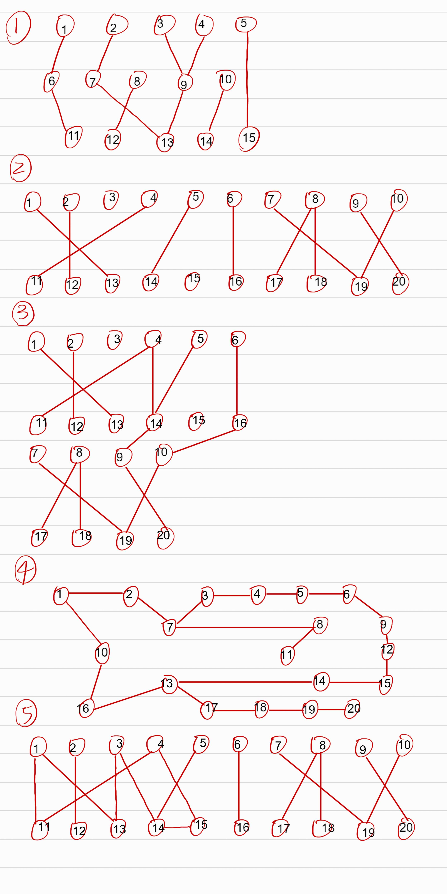
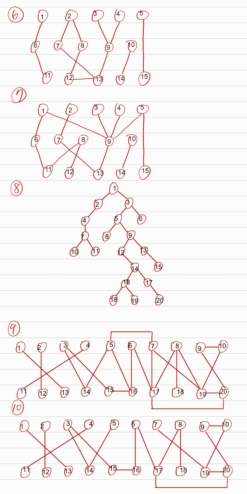

# Graph Theorey
---
## data_structure:
```
----Project_1
  |----README.md
  |----Project_report.docs  //NUFINISH
  |----Makefile             //NUFINISH
  |----Biopartite.cpp
  |----adj_list.cpp
  |----adj_matrix.cpp
  |----adj_matrix_pointer.cpp
  |----adj_list_pointer.cpp
  |----main_time_calculating.cpp
  |----test_cases
     |----11.txt
     |----12.txt
     |----13.txt
     |----test_adj_list.txt
     |----test_adj_list_for_pointer.txt
     |----test_adj_matrix.txt
     |----benchmarks.jpg
  |----open_banchmarks
     |----1.txt
     |----2.txt
     |----3.txt
     |----4.txt
     |----5.txt
     |----6.txt
     |----7.txt
     |----8.txt
     |----9.txt
     |----10.txt
     |----test_adj_list.txt
     |----test_adj_list_for_pointer.txt
     |----test_adj_matrix.txt
     |----open_benchmarks_1.jpg
     |----open_benchmarks_2.jpg
  |----test_time
     |----adj_list_time.cpp
     |----adj_matrix_time.cpp
     |----adj_matrix_pointer_time.cpp
     |----adj_list_pointer_time.cpp
```
## input file:
```
/test_cases/test_adj_matrix.txt
for adj_matrix.cpp
    adj_matrix_pointer.cpp
    adj_matrix_time.cpp
    adj_matrix_pointer_time.cpp

/test_cases/test_adj_list.txt
for adj_list.cpp
    adj_list_time.cpp

/test_cases/test_adj_list_for_pointer.txt
for adj_list_pointer.cpp
    adj_list_pointer_time.cpp

/open_benchmarks/test_adj_matrix.txt
for adj_matrix.cpp
    adj_matrix_pointer.cpp
    adj_matrix_test.cpp
    adj_matrix_pointer_test.cpp
    
/open_benchmarks/test_adj_list.txt
for adj_list.cpp
    adj_list_time.cpp

/open_benchmarks/test_adj_list_for_pointer.txt
for adj_list_pointer.cpp
    adj_list_pointer_time.cpp

...
```

## test_case(test_adj_list.txt)
```
number of graphs
number of vertex in this graph
adj vertex of vertex(1)
adj vertex of vertex(2)
adj vertex of vertex(3)
...

number of vertex in this graph
adj vertex of vertex(1)
adj vertex of vertex(2)
adj vertex of vertex(3)
...
```

## test_case(test_adj_list_for_pointer.txt)
```
number of graphs
number of vertex in this graph
number_of_adj_vertexes adj_vertex_1_of_vertex(1)...
number_of_adj_vertexes adj_vertex_1_of_vertex(2)...
number_of_adj_vertexes adj_vertex_1_of_vertex(3)...
...

number of graphs
number of vertex in this graph
number_of_adj_vertexes adj_vertex_1_of_vertex(1)...
number_of_adj_vertexes adj_vertex_1_of_vertex(2)...
number_of_adj_vertexes adj_vertex_1_of_vertex(3)...
...
```

## test_case(test_adj_matrix.txt)
```
number of graphs
number of vertex in this graph
adj matrix of this graph

number of vertex in this graph
adj matrix of this graph
...
```

## test_time folder
```
精準到奈秒計算時間
```

## benchmarks


## open benchmarks


