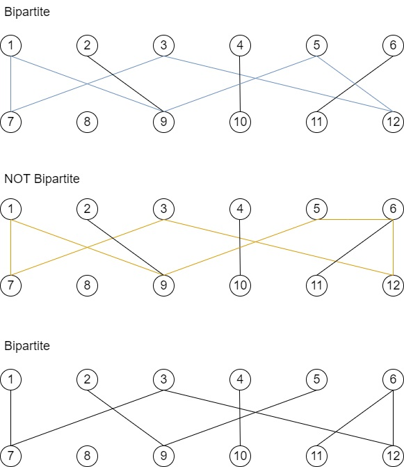

# Graph Theorey
---
## data_structure:
```
----Project_1
  |----README.md
  |----Project_report.docs  //NUFINISH
  |----Makefile             //NUFINISH
  |----Biopartite.cpp
  |----benchmarks
     |----11.txt
     |----12.txt
     |----13.txt
     |----test.txt
     |----test_adj_matrix.txt
     |----benchmarks.jpg
  |----open_banchmarks
     |----1.txt
     |----2.txt
     |----3.txt
     |----4.txt
     |----5.txt
     |----6.txt
     |----7.txt
     |----8.txt
     |----9.txt
     |----10.txt
     |----test.txt
     |----test_adj_matrix.txt
     |----open_benchmarks_1.jpg
     |----open_benchmarks_2.jpg
```
## input file:
```
test.txt
...
```

## test_case(.txt)
```
number of graphs
number of vertex in this graph
adj vertex of vertex(1)
adj vertex of vertex(2)
adj vertex of vertex(3)
...

number of vertex in this graph
adj vertex of vertex(1)
adj vertex of vertex(2)
adj vertex of vertex(3)
...
```

## benchmarks


## open benchmarks


